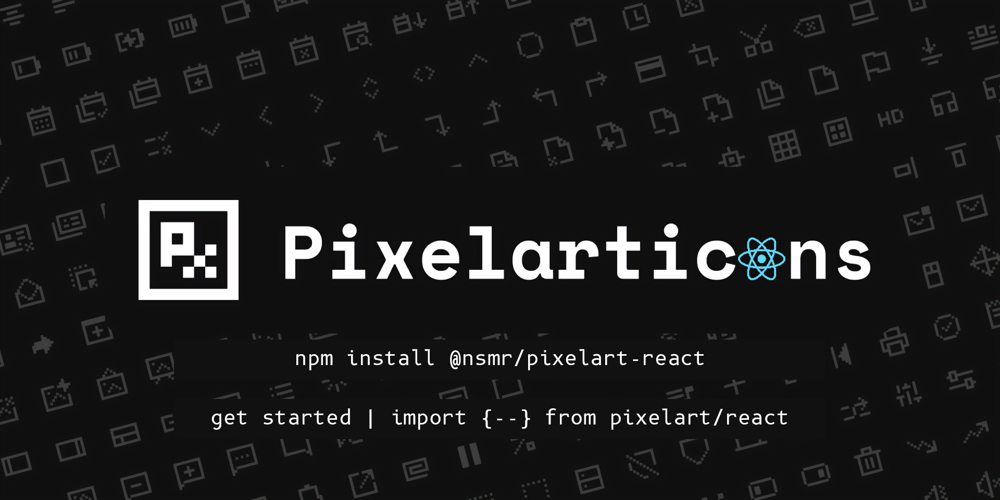

# Pixelarticons React



React components for [pixelarticons](https://github.com/halfmage/pixelarticons).

## Icon Gallery

<p align="center">
  
</p>

**New!** [View the full interactive gallery with all 486 icons](https://gitntg.github.io/pixelarticons-react/examples/gallery-generator.html)

## 🚨 Version 2.0.0 Migration Guide 🚨

The package includes several improvements in version 2.0.0:

- Interactive gallery with all 486 icons
- Improved documentation
- Better React component support
- Enhanced build process

### Migration Steps:

1. Update your package.json dependency:

```diff
- "@nicholuassommer/pixelarticons-react": "^1.0.1"
+ "@nsmr/pixelart-react": "^2.0.0"
```

2. Update your imports:

#### Previous import style:

```jsx
import { User, Heart } from "@nicholuassommer/pixelarticons-react";
```

#### New import options:

```jsx
// Option 1: Direct from package (similar to before)
import { User, Heart } from "@nsmr/pixelart-react";

// Option 2: New shorter path
import { User, Heart } from "pixelart/react";
```

## Installation

```bash
npm install @nsmr/pixelart-react
```

## Usage

### Direct Import

```jsx
import { User, Heart, ArrowRight } from "pixelart/react";

function App() {
  return (
    <div>
      <User size={24} />
      <Heart size={24} />
      <ArrowRight size={24} />
    </div>
  );
}
```

### Using Icon Component

```jsx
import { Icon } from "pixelart/react";

function App() {
  return (
    <div>
      <Icon name="user" size={24} />
      <Icon name="heart" size={24} />
      <Icon name="arrow-right" size={24} />
    </div>
  );
}
```

## Icon Props

All icons accept the following props:

| Prop      | Type             | Default | Description                                   |
| --------- | ---------------- | ------- | --------------------------------------------- |
| size      | number \| string | 24      | Width and height of the icon                  |
| className | string           | ''      | Additional CSS classes                        |
| ...       | SVGProps         |         | All other props are passed to the SVG element |

## Available Icons

Here's a complete list of all available icons:

### Icons Starting with Numbers (require special syntax)

For icons starting with numbers, you can either use the component name with "Icon" prefix or use the original name with the `Icon` component:

```jsx
// Direct import
import { Icon4g } from "pixelart/react";

// Or using the Icon component
<Icon name="4g" />;
```

- `Icon4g` (or `<Icon name="4g" />`)
- `Icon4k` (or `<Icon name="4k" />`)
- `Icon4kBox` (or `<Icon name="4k-box" />`)
- `Icon5g` (or `<Icon name="5g" />`)

### Complete Icon List

Here's an alphabetical list of all available icon components:

- AbTesting
- Ac
- AddBoxMultiple
- AddBox
- AddCol
- AddGrid
- AddRow
- Alert
- AlignCenter
- AlignJustify
- AlignLeft
- AlignRight
- Analytics
- Anchor
- Android
- Animation
- Archive
- ArrowBarDown
- ArrowBarLeft
- ArrowBarRight
- ArrowBarUp
- ArrowDownBox
- ArrowDown
- ArrowLeftBox
- ArrowLeft
- ArrowRightBox
- ArrowRight
- ArrowUpBox
- ArrowUp
- ArrowsHorizontal
- ArrowsVertical
- ArtText
- ArticleMultiple
- Article
- AspectRatio
- At
- Attachment
- AudioDevice
- Backspace
- BagAlt
- Bag
- Bank
- BarcodeAlt
- Barcode
- Basketball
- Bath
- Battery0
- Battery1
- Battery2
- Battery3
- BatteryCharging
- Beaker
- BedDouble
- BedSingle
- Bell
- Bitcoin
- Bluetooth
- Bold
- BookAlt
- Book
- Bookmark
- BorderAll
- BorderBottom
- BorderHorizontal
- BorderInner
- BorderLeft
- BorderNone
- BorderOuter
- BorderRight
- BorderStyle
- BorderTop
- BorderVertical
- Bot
- Bowl
- Box
- Boy
- Braces
- Brackets
- Brain
- Briefcase
- Broom
- Browser
- Brush
- Bug
- Building
- BulbOff
- Bulb
- Button
- Cake
- Calculator
- CalendarAlt
- Calendar
- Camera
- Car
- Caret
- Cast
- Chain
- Chat
- CheckBox
- CheckDouble
- Check
- Chess
- ChevronDown
- ChevronLeft
- ChevronRight
- ChevronUp
- Chip
- Clipboard
- ClockAlt
- Clock
- Cloud
- Code
- CodepenAlt
- Codepen
- Cog
- ColorPicker
- Colors
- Columns
- Command
- Compass
- Contacts
- Contract
- Cookie
- Copy
- CornerDownLeft
- CornerDownRight
- CornerLeftDown
- CornerLeftUp
- CornerRightDown
- CornerRightUp
- CornerUpLeft
- CornerUpRight
- CpuAlt
- Cpu
- CreditCard
- Crop
- Cross
- Crosshair
- Cube
- CurlyBraces
- Currency
- Dashboard
- Database
- Deletion
- Delimiter
- Deviantart
- Devices
- Diamond
- Direction
- Discord
- Dish
- Divide
- Dna
- Dock
- Document
- Documents
- DonutChart
- Door
- DotGrid
- DotsMidsplit
- Dots
- Download
- Drag
- DragAlt
- Dribbble
- Drink
- DropInvert
- Drop
- Duplicate
- Enter
- Envelope
- Equalizer
- EraserAlt
- Eraser
- Exchange
- Exclude
- ExpandAlt
- Expand
- Extension
- Eye
- EyeAlt
- Feather
- Female
- File
- FilmStack
- Film
- FilterAlt
- Filter
- Fingerprint
- FlagAlt
- Flag
- FolderAdd
- Folder
- Font
- Fork
- Fountain
- Gamepad
- Gatsbyjs
- Gesture
- Gift
- Girl
- Git
- GithubAlt
- Github
- Gitlab
- Globe
- Google
- Graphql
- Grid
- GroupAdd
- Group
- Guitar
- Hash
- Hashtag
- Headphones
- Heart
- HeartFilled
- HeartRate
- History
- Home
- Hourglass
- House
- Id
- Image
- Import
- Inclination
- Infinity
- Info
- Injection
- Instagram
- Intersect
- IosFillet
- IosRadio
- IosSwitch
- Italic
- Jpg
- Key
- Keyboard
- KeyboardAlt
- Keyhole
- Laptop
- Lastfm
- LassoVectorSelection
- LassoVectorSelect
- Layer
- Layout
- Leaf
- Library
- License
- Lifebuoy
- Lightbulb
- LineSpace
- Link
- Linkedin
- Linux
- ListAdd
- ListBox
- ListMinus
- List
- Litecoin
- Loader
- Loading
- Location
- LockOpen
- Lock
- Log
- LogicAnd
- LogicOr
- Login
- Logout
- Luggage
- Mail
- Mailbox
- Male
- Map
- Markdown
- Maximise
- Medal
- Mega
- Menu
- Mic
- MicAlt
- Microsoft
- Minimise
- MinusBox
- MinusBoxMultiple
- Minus
- Monitor
- MoonAlt
- Moon
- MoreHorizontal
- MoreVertical
- Mouse
- Move
- Music
- Navigation
- Nextjs
- NoteText
- Note
- Npm
- OneFingerSelect
- OneFingerTap
- Opacity
- OpenInBrowser
- OpenInWindow
- Options
- PageBreak
- Page
- Paint
- PaletteAlt
- Palette
- Pan
- Paperclip
- Parachute
- Paragraph
- Paste
- Pause
- Paw
- PenAlt
- Pen
- PentagonBottom
- PentagonDown
- PentagonLeft
- PentagonRight
- PentagonTop
- PentagonUp
- Performance
- Phone
- PhoneMissed
- PieChart
- PieChartAlt
- Pin
- Placeholder
- Planet
- Play
- Playlist
- Plus
- Power
- Prev
- Print
- RadioHandheld
- RadioOn
- RadioSignal
- RadioTower
- Reciept
- RecieptAlt
- Redo
- Reload
- RemoveBox
- RemoveBoxMultiple
- Repeat
- Reply
- ReplyAll
- RoundedCorner
- Save
- Scale
- Script
- ScriptText
- ScrollHorizontal
- ScrollVertical
- Sd
- Search
- Section
- SectionCopy
- SectionMinus
- SectionPlus
- SectionX
- Server
- SharpCorner
- Shield
- ShieldOff
- Ship
- ShoppingBag
- Shuffle
- Sliders
- Sliders2
- Sort
- SortAlphabetic
- SortNumeric
- Speaker
- SpeedFast
- SpeedMedium
- SpeedSlow
- Spotlight
- Store
- Subscriptions
- Subtitles
- Suitcase
- SunAlt
- Sun
- Switch
- Sync
- Tab
- Table
- Tea
- Teach
- TextAdd
- TextColums
- TextSearch
- TextWrap
- Timeline
- ToggleLeft
- ToggleRight
- Tournament
- TrackChanges
- TrashAlt
- Trash
- TrendingDown
- TrendingUp
- Trending
- Trophy
- Truck
- Undo
- Ungroup
- Unlink
- Upload
- UserMinus
- UserPlus
- User
- Users
- UserX
- VideoOff
- Video
- ViewCol
- ViewList
- ViewportNarrow
- ViewportWide
- Visible
- Volume1
- Volume2
- Volume3
- VolumeMinus
- VolumePlus
- VolumeVibrate
- VolumeX
- Volume
- Wallet
- WarningBox
- Wind
- Zap
- ZoomIn
- ZoomOut

## Icon Demo

For a visual reference of all icons, run the demo:

```bash
npm run demo
```

This will start a local server with a visual catalog of all available icons.

## License

MIT
